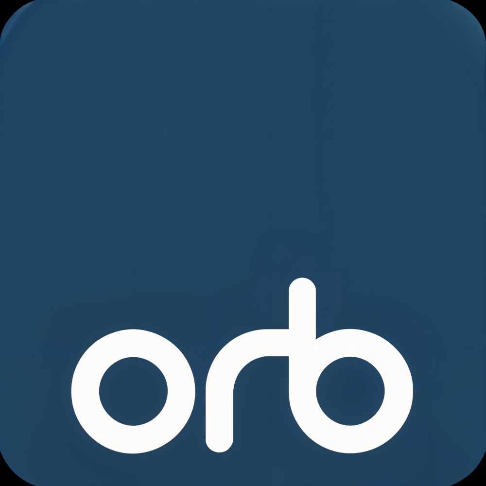

# The Open Red Button Project

The Open Red Button Project is a cross-browser solution for HbbTV.

It is a collection of components that implement the extensions required to support HbbTV applications in a browser.

For more information or to contact us, see: https://orb-tv.org/
